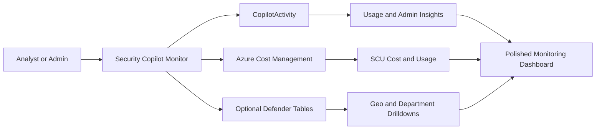

# 🛡️ Security Copilot Monitor

**A production-ready Microsoft Security Copilot agent for usage, adoption, administration, anomaly, and SCU cost visibility.**

Security Copilot Monitor turns your Security Copilot telemetry and Azure Cost Management data into a clean, executive-ready dashboard inside Microsoft Security Copilot itself. It helps security leaders, SOC managers, platform owners, and administrators answer the questions that come up after Security Copilot is deployed:

- Who is actually using Security Copilot?
- **What did Security Copilot cost over the rolling last 30 days (in currency and units)?**
- Which workspaces and agents are most active?
- Are there unusual usage spikes?
- What plugin and agent administration activity occurred?
- Is spend coming from provisioned SCUs, overage SCUs, or both?

> 📸 **Hero screenshot**
 
> 

> 🎬 **Demo video**  

> https://github.com/user-attachments/assets/20111724-dc4a-44ba-a802-54c46cab9799

---

## ✨ What Makes It Useful

Security Copilot is powerful, but usage, operational, and billing signals are spread across different places. Security Copilot Monitor brings those signals together in one agent experience.

| Area | What You Get |
|---|---|
| 👥 **User adoption** | Top active users, prompts, responses, sessions, active days, and last activity. |
| 🏢 **Workspace usage** | Workspace-level interaction volume, sessions, unique users, and plugin admin activity. |
| 🛠️ **Plugin and agent administration** | Plugin create/delete/enable/disable activity and custom agent trigger counts. |
| 🚨 **Usage anomalies** | Spike and drop detection over the recent activity baseline. |
| 💰 **SCU cost** | Actual Azure Cost Management billing data with daily cost, usage quantity, meter, resource, and currency. |
| ✅ **Recommended follow-ups** | Short, grounded next steps based on the data returned in the current run. |

The result is a dashboard that is useful for weekly operational reviews, Security Copilot adoption tracking, cost conversations, governance checks, and leadership updates.

---

## 🧭 The Dashboard Experience

The default run generates a polished six-section dashboard:

1. **👥 Top Active Users**  
   Who is using Security Copilot the most, how often, and across how many sessions.
> 

2. **🏢 Workspace Usage**  
   Which workspace is seeing activity and how that maps to prompts, sessions, users, and plugin administration.
> 

3. **🛠️ Plugin and Agent Admin Activity**  
   Plugin management actions and triggered custom agents, summarized for governance and operational awareness.
>
   
4. **🚨 Usage Anomalies or Spikes**  
   Notable activity changes, including dates, event counts, and spike/drop classification.
>
   
5. **💰 Cost - Rolling Last 30 Days**  
   Real Azure billing data for Microsoft Security Copilot, including total cost, overage/provisioned split, daily cost ledger, usage quantity, and capacity/meter details.
>
   
6. **✅ Recommended Follow-Ups**  
   Practical next actions based on adoption, administration, anomalies, and spend.
>
   
> 📸 **Cost section screenshot placeholder**  

> 


---

## 🧠 How It Works

Security Copilot Monitor is delivered as a **single importable Security Copilot agent manifest**.

The agent combines orchestration, usage analytics, cost retrieval, grounded cost analysis, and dashboard formatting into one agent package.



### Primary Data Sources

| Source | Purpose |
|---|---|
| **CopilotActivity** | Primary usage, prompt, response, session, workspace, plugin, and agent activity telemetry. |
| **Azure Cost Management** | Real Security Copilot SCU billing data, including daily cost, usage quantity, meter, resource, and currency. |
| **CloudAppEvents** | Optional geography-oriented drilldowns. |
| **IdentityInfo** | Optional department/team-oriented drilldowns when identity enrichment is available. |

The default dashboard focuses on the most reliable operational signals: usage, workspace activity, plugin/agent administration, anomaly detection, and rolling 30-day cost.

---

## 🔐 Why It Is Safe for Production

Security Copilot Monitor is designed to be comfortable in production environments.

### ✅ Permission-Aware

The agent uses the permissions of the signed-in user. If the user cannot read a data source, the agent cannot magically bypass that boundary.

### ✅ Currency-Safe Cost Handling

Cost comes from Azure Cost Management. The agent preserves the source currency, never converts currencies, and never estimates SCU cost from prompts, sessions, or interaction counts.

### ✅ Minimal Operational Footprint

No additional Azure resources are required. No database, function app, storage account, proxy, or external service is deployed by this agent.

### ✅ Read-Oriented by Design

The agent reads telemetry and billing data. It does not create, update, delete, deploy, disable, or modify Azure or Security Copilot resources.

### ✅ Grounded Output Rules

The dashboard is instructed to use only tool results from the current run. It must not reuse example values, memory, or unrelated conversation context.

### ✅ Runtime Subscription Input

The Azure subscription is supplied at run time through `TargetSubscription`. The manifest does not require hardcoding your tenant, subscription, resource group, workspace, or capacity name.

### ✅ No Scheduled Run by Default

The manifest is configured for on-demand use by default. Administrators can enable automation later if they want recurring monitoring.

---

## 📦 What Is Included

| File | Purpose |
|---|---|
| `SecurityCopilotMonitor - Agent.yaml` | The public-ready combined Security Copilot Monitor agent manifest. |
| Hosted Cost Management OpenAPI definition | The read-only Azure Cost Management API definition referenced by the manifest. |

The user-facing agent identity is:

| Field | Value |
|---|---|
| **Agent name** | `SecurityCopilotMonitorAgent` |
| **Display name** | `Security Copilot Monitor` |
| **Primary input** | `TargetSubscription` |
| **Default mode** | On-demand/manual run |

---

## ✅ Prerequisites

Before importing the agent, confirm these items are in place.

### Required

| Requirement | Why It Matters |
|---|---|
| **Microsoft Security Copilot access** | Required to import and run the custom agent. |
| **CopilotActivity available in Defender XDR / Sentinel-backed hunting** | Powers the usage, adoption, workspace, plugin, agent, and anomaly sections. |
| **Azure subscription containing Security Copilot billing records** | Needed for the rolling 30-day SCU cost section. |
| **Reader or Cost Management Reader on the target subscription** | Allows the signed-in user to retrieve billing data from Azure Cost Management. |
| **AAD delegated access to Azure Resource Manager** | Used for the Cost Management query through `https://management.azure.com/user_impersonation`. |
| **Hosted OpenAPI spec URL reachable by Security Copilot** | Required for the API tool declared in the agent manifest. |

### Optional, for richer drilldowns

| Optional Source | Adds |
|---|---|
| **CloudAppEvents** | Geographic usage prompts such as country or city distribution. |
| **IdentityInfo** | Department/team usage prompts when identity enrichment is populated. |

---

## 🚀 Installation

1. Open **Microsoft Security Copilot**.

2. Go to **Agents** and import the combined manifest:

   ```text
   SecurityCopilotMonitor - Agent.yaml
   ```

3. Confirm the imported agent appears as:

   ```text
   Security Copilot Monitor
   ```

4. On first cost-related run, approve the delegated Azure Resource Manager permission prompt if shown.

5. Start the agent and provide the Azure subscription GUID in `TargetSubscription`.

6. Run the default dashboard prompt or one of the prompts below.

> 📸 **Import screenshot placeholder**  
> Add a screenshot of the custom agent import screen here.

> 📸 **Agent details screenshot placeholder**  
> Add a screenshot showing the imported `Security Copilot Monitor` agent and its on-demand trigger state.

---

## 💬 Prompts to Try

The agent works well with both broad dashboard prompts and focused follow-ups.

### 🛡️ Full Dashboard

```text
Generate the complete Security Copilot usage and cost monitoring dashboard.
```

```text
Show me the Security Copilot monitoring dashboard for this subscription.
```

```text
Give me an executive summary of Security Copilot usage, admin activity, anomalies, and cost.
```

### 👥 User Adoption

```text
Who are the most active Security Copilot users in the last 30 days?
```

```text
Show me users with the highest prompt and response activity.
```

```text
Which users are driving Security Copilot adoption?
```

### 🏢 Workspace Activity

```text
Show workspace-wise Security Copilot usage.
```

```text
Which workspace has the most Security Copilot interactions and sessions?
```

```text
Summarize workspace usage and plugin administration together.
```

### 🛠️ Plugin and Agent Governance

```text
Show plugin create, delete, enable, and disable activity for the last 30 days.
```

```text
Which custom Security Copilot agents were triggered the most?
```

```text
Give me a governance summary of plugin and agent administration.
```

### 🚨 Anomaly Review

```text
Were there any Security Copilot usage spikes or drops recently?
```

```text
Show unusual Security Copilot activity and explain what changed.
```

```text
Find usage anomalies and correlate them with admin activity.
```

### 💰 Cost and SCU Spend

```text
How much did Security Copilot cost in the rolling last 30 days?
```

```text
Break down Security Copilot cost by daily usage and meter.
```

```text
Show provisioned versus overage SCU cost.
```

```text
Which days had the highest Security Copilot cost?
```

```text
Summarize SCU usage quantity and cost trends.
```

### 🌍 Optional Drilldowns

These depend on optional Defender data sources being populated.

```text
Where are users accessing Security Copilot from?
```

```text
Show Security Copilot usage by department.
```

```text
Which teams are using Security Copilot the most?
```

---

## 🧾 Example Output Shape

```text
🛡️ Security Copilot Monitoring Dashboard

Scope: Usage lookback 30 days · Cost window Rolling last 30 days · Subscription 00000000-0000-0000

✨ Executive Snapshot
- 👤 Top user: user@contoso.com with 180 interactions.
- 🏢 Top workspace: SecOps with 180 interactions.
- ⚙️ Admin activity: 189 plugin actions observed.
- 💰 Cost: 10,154.93 INR across 14 usage days.

👥 1. Top Active Users
...

💰 5. Cost - Rolling last 30 days
- Total Cost: 10,154.93 INR
- Overage SCU Cost: 10,154.93 INR
- Provisioned SCU Cost: 0.00 INR

Daily Cost Ledger
| Date | Total Cost | Usage Quantity |
|---|---:|---:|
| 2026-06-07 | 798.85 INR | 1.60 |
```

> 📸 **Example output screenshot placeholder**  
> Add an anonymized sample dashboard screenshot here.

---

## 🧩 Good to Know

- **Cost is actual Azure Cost Management data**, not a prompt/session estimate.
- **Billing data can lag by 24-48 hours**, which is normal for Azure Cost Management.
- **The dashboard masks the subscription identifier** in the final response.
- **If a section has no returned data**, the agent reports that clearly rather than inventing values.
- **The agent is on-demand by default**, so it will not start running daily unless an admin chooses to automate it.
- **The same agent can be reused across tenants** as long as the required telemetry and permissions are available.

---

## ❤️ Built For Security Teams

Security Copilot Monitor is meant to make adoption measurable, operations visible, and SCU spend explainable without forcing teams to jump between multiple portals.

It gives leaders a quick read, gives administrators the details they need, and gives practitioners a simple way to ask better follow-up questions inside the Security Copilot experience they already use.
